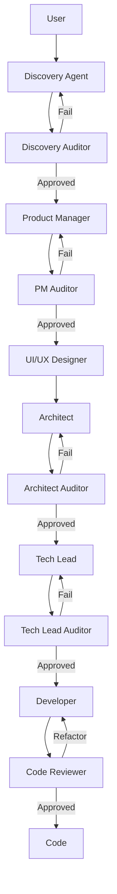

# AI-Augmented Development (AIAD) Agents

This repository follows an **AI-Augmented Development (AIAD)** approach, employing a team of specialized agents to transform ideas into high-quality software.
> [!IMPORTANT]
> These agents are designed specifically for **Antigravity with Gemini 3**. Other environments may not function correctly.

## Agent Workflow

The workflow follows a logical progression from discovery to final delivery, with rigorous audits at each stage.

## Agent Catalog

### 1. Strategic & Discovery Phase
*   **Discovery (`discovery.md`):** Acts as "Quality Filter 0". Challenges the idea, isolates the real problem, and defines fundamental requirements and MVP.
*   **Discovery Auditor (`discovery-auditor.md`):** Technical gatekeeper ensuring zero ambiguity before proceeding to functional detailing.

### 2. Product & Requirements Phase
*   **Product Manager (`product-manager.md`):** Transforms business requirements into detailed Epics, User Stories, and Acceptance Criteria (Gherkin).
*   **Product Manager Auditor (`product-manager-auditor.md`):** Ensures no business rules are lost or altered during translation into stories.
*   **UI/UX Designer (`ui-ux-designer.md`):** Creates the visual strategy, design system, and interaction flows ready for implementation.

### 3. Architecture & Engineering Phase
*   **Architect (`architect.md`):** Designs the technical blueprint (TDD), defining patterns, Mermaid diagrams, NFRs, and tech stack.
*   **Architect Auditor (`architect-auditor.md`):** Critical reviewer validating feasibility, security, and architectural compliance of the design.
*   **Tech Lead (`techlead.md`):** Decomposes the technical design into a granular, actionable, and prioritized backlog.
*   **Tech Lead Auditor (`tech-lead-auditor.md`):** Guarantees the backlog covers 100% of functional requirements and architectural constraints.

### 4. Execution & Quality Phase
*   **Developer (`developer.md`):** Implements the system strictly following the TDD and Clean Code standards, prioritizing infrastructure (Docker) and contracts.
*   **Code Reviewer (`code-reviewer.md`):** Security and quality auditor ensuring architectural integrity and code health before merge.
