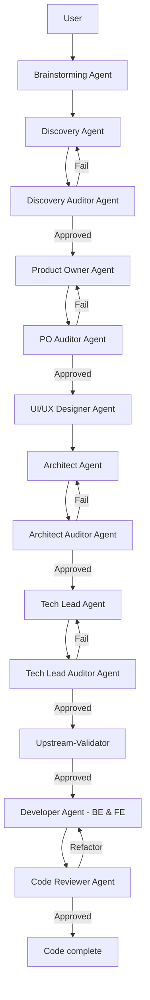

# AI-Augmented Development (AIAD) Agents

This repository follows an **AI-Augmented Development (AIAD)** approach, employing a team of specialized agents to transform ideas into high-quality software.

## Agent Workflow

The workflow follows a logical progression from discovery to final delivery, with rigorous audits at each stage.

```mermaid
graph TD
    User[User] --> Brainstorming[Brainstorming Agent]
    Brainstorming --> Discovery[Discovery Agent]
    Discovery --> DiscoveryAudit[Discovery Auditor Agent]
    DiscoveryAudit -- "Fail" --> Discovery
    DiscoveryAudit -- "Approved" --> PO[Product Owner Agent]

    PO --> POAudit[PO Auditor Agent]
    POAudit -- "Fail" --> PO
    POAudit -- "Approved" --> UX[UI/UX Designer Agent]

    UX --> Arch[Architect Agent]
    Arch --> ArchAudit[Architect Auditor Agent]
    ArchAudit -- "Fail" --> Arch
    ArchAudit -- "Approved" --> TL[Tech Lead Agent]

    TL --> TLAudit[Tech Lead Auditor Agent]
    TLAudit -- "Fail" --> TL
    TLAudit -- "Approved" --> Upstream-Validator
    Upstream-Validator -- "Approved" --> Dev[Developer Agent - BE & FE]

    Dev --> Review[Code Reviewer Agent]
    Review -- "Refactor" --> Dev
    Review -- "Approved" --> Final[Code complete]
```

## Agent Catalog

### 1. Strategic & Discovery Phase
*   **Brainstorming (`brainstorming.md`):** Acts as "Quality Filter 0". Challenges the idea, isolates the real problem, and defines fundamental requirements and MVP.
*   **Discovery (`discovery.md`):** Refines business ideas into a macro-scope document for an MVP, avoiding technical bias unless strictly required.
*   **Discovery Auditor (`discovery-auditor.md`):** Technical gatekeeper ensuring zero ambiguity before proceeding to functional detailing.

### 2. Product & Requirements Phase
*   **Product Owner (`product-owner.md`):** Transforms business requirements into detailed Epics, User Stories, and Acceptance Criteria (Gherkin).
*   **Product Owner Auditor (`product-owner-auditor.md`):** Ensures no business rules are lost or altered during translation into stories.
*   **UI/UX Designer (`ui-ux-designer.md`):** Creates the visual strategy, design system, and interaction flows ready for implementation.

### 3. Architecture & Engineering Phase
*   **Architect (`architect.md`):** Designs the technical blueprint (TDD), defining patterns, Mermaid diagrams, NFRs, and tech stack.
*   **Architect Auditor (`architect-auditor.md`):** Critical reviewer validating feasibility, security, and architectural compliance of the design.
*   **Tech Lead (`techlead.md`):** Decomposes the technical design into a granular, actionable, and prioritized backlog.
*   **Tech Lead Auditor (`techlead-auditor.md`):** Guarantees the backlog covers 100% of functional requirements and architectural constraints.
*   **QA Lead (`qalead.md`):** Transform business requirements into an exhaustive suite of actionable test cases.
*   **QA Lead Auditor (`qalead-auditor.md`):** Quality Assurance Quality Gate agent ensuring that generated test suites provide 100% functional coverage without redundant or out-of-scope test cases.

### 4. Execution & Quality Phase
*   **Backend Developer (`backend-developer.md`):** Implements the system strictly following the TDD and Clean Code standards, prioritizing infrastructure (Docker) and contracts.
*   **Frontend Developer (`frontend-developer.md`):** Implements frontend
*   **Code Reviewer (`code-reviewer.md`):** Security and quality auditor ensuring architectural integrity and code health before merge.

---

## Workflow

### 1. Create
* The workflow is a structured refinement pipeline that guides a raw product idea to the development-ready state (Definition of Ready - DoR).

---

> [!IMPORTANT]
> These agents are designed specifically for **Gemini 3.1+**. Other environments may not function correctly.