# Logical Workflow Structure

```python
Workflow(
    name="create",
    nodes=[
        Node(agent="brainstorming", input="raw_idea", next="User_Confirmation_Brainstorm"),
        Node(id="User_Confirmation_Brainstorm", conditional_logic={
            "YES": "discovery",
            "NO": "brainstorming"
        }),
        Node(agent="discovery", input="idea_handoff", next="discovery-auditor"),
        Node(agent="discovery-auditor", input="mvp_scope", next="Decision_Node"),
        Node(id="Decision_Node", conditional_logic={
            "APPROVED": "User_Validation_Scope",
            "REJECTED": "discovery",
            "NEEDS_CLARIFICATION": "discovery"
        }),
        Node(id="User_Validation_Scope", conditional_logic={
            "YES": "product-owner",
            "NO": "discovery"
        }),
        Node(agent="product-owner", input="mvp_scope", next="product-owner-auditor"),
        Node(agent="product-owner-auditor", input="PO_artifacts", next="PO_Decision_Node"),
        Node(id="PO_Decision_Node", conditional_logic={
            "APPROVED": "User_Validation_Requirements",
            "REJECTED": "product-owner"
        }),
        Node(id="User_Validation_Requirements", conditional_logic={
            "YES": "ui-ux-designer",
            "NO": "product-owner"
        }),
        Node(agent="ui-ux-designer", input="PO_artifacts", next="User_Validation_UI_UX"),
        Node(id="User_Validation_UI_UX", conditional_logic={
            "YES": "architect",
            "NO": "ui-ux-designer"
        }),
        Node(agent="architect", input=["mvp_requirements", "ui_ux_strategy"], next="architect-auditor"),
        Node(agent="architect-auditor", input="technical_design", next="Architect_Decision_Node"),
        Node(id="Architect_Decision_Node", conditional_logic={
            "APPROVED": "User_Validation_Architecture",
            "REJECTED": "architect"
        }),
        Node(id="User_Validation_Architecture", conditional_logic={
            "YES": "techlead",
            "NO": "architect"
        }),
        Node(agent="techlead", input=["mvp_requirements", "ui_ux_strategy", "technical_design"], next="techlead-auditor"),
        Node(agent="techlead-auditor", input="mvp_backlog", next="Techlead_Decision_Node"),
        Node(id="Techlead_Decision_Node", conditional_logic={
            "APPROVED": "User_Validation_Backlog",
            "REJECTED": "techlead"
        }),
        Node(id="User_Validation_Backlog", conditional_logic={
            "YES": "qalead",
            "NO": "techlead"
        }),
        Node(agent="qalead", input=["mvp_requirements", "ui_ux_strategy"], next="qa-lead-auditor"),
        Node(agent="qa-lead-auditor", input=["mvp_requirements", "ui_ux_strategy", "mvp_test_cases"], next="QA_Decision_Node"),
        Node(id="QA_Decision_Node", conditional_logic={
            "APPROVED": "User_Validation_QA",
            "REJECTED": "qalead"
        }),
        Node(id="User_Validation_QA", conditional_logic={
            "YES": "upstream-validator",
            "NO": "qalead"
        }),
        Node(agent="upstream-validator", input=["mvp_requirements", "technical_design", "mvp_backlog", "mvp_test_cases"], next="Upstream_Decision_Node"),
        Node(id="Upstream_Decision_Node", conditional_logic={
            "APPROVED": "Done",
            "REJECTED": "techlead"
        })
    ],
    state_persistence=True
)
```

## Workflow Diagram

```mermaid
graph TD
    User[User Idea] --> Brainstorm[1. Brainstorming Agent]
    Brainstorm -- "Refine and Stress-Test" --> BrainstormConfirm{Confirm: Closed Idea?}
    
    BrainstormConfirm -- "NO (Keep Brainstorming)" --> Brainstorm
    BrainstormConfirm -- "YES (Save docs/idea.md)" --> Discovery[2. Discovery Agent]
    
    Discovery -- "Socratic MVP Scoping" --> User
    Discovery -- "Auto-Save docs/mvp_scope.md" --> Auditor[3. Discovery Auditor]
    
    Auditor -- "Strict JSON Evaluation" --> Decision{Decision Node}
    
    Decision -- "REJECTED / NEEDS_CLARIFICATION" --> Discovery
    Decision -- "APPROVED" --> ScopeConfirm{User: Confirm MVP Scope?}
    
    ScopeConfirm -- "NO (Refine Scope)" --> Discovery
    ScopeConfirm -- "YES" --> PO[4. Product owner Agent]
    
    PO -- "Elicit stories & BDD" --> User
    PO -- "Auto-Save docs/mvp_requirements.md" --> POAuditor[5. PO Auditor]
    
    POAuditor -- "Strict JSON Gap Analysis" --> PODecision{PO Decision Node}
    
    PODecision -- "REJECTED" --> PO
    PODecision -- "APPROVED" --> ReqConfirm{User: Confirm Requirements?}
    
    ReqConfirm -- "NO (Refine Requirements)" --> PO
    ReqConfirm -- "YES" --> UX[6. UI/UX Designer Agent]
    
    UX -- "UX Flows & Design System" --> UXConfirm{User: Confirm UI/UX?}
    
    UXConfirm -- "NO (Refine Visuals)" --> UX
    UXConfirm -- "YES (Save docs/ui_ux_strategy.md)" --> Arch[7. Architect Agent]
    
    Arch -- "Technical Design & TDD" --> ArchAuditor[8. Architect Auditor]
    ArchAuditor -- "Strict Verification" --> ArchDecision{Architect Decision Node}
    
    ArchDecision -- "REJECTED" --> Arch
    ArchDecision -- "APPROVED" --> ArchConfirm{User: Confirm Architecture?}
    
    ArchConfirm -- "NO (Refine Architecture)" --> Arch
    ArchConfirm -- "YES (Save docs/technical_design.md)" --> TL[9. Techlead Agent]
    
    TL -- "Granular Technical Backlog" --> TLAuditor[10. Techlead Auditor]
    TLAuditor -- "Three-Way Match Audit" --> TLDecision{Techlead Decision Node}
    
    TLDecision -- "REJECTED" --> TL
    TLDecision -- "APPROVED" --> TLConfirm{User: Confirm Backlog?}
    
    TLConfirm -- "NO (Refine Tasks)" --> TL
    TLConfirm -- "YES (Save docs/mvp_backlog.md)" --> QALead[11. QA Lead Agent]
    
    QALead -- "Deterministic Test Suite" --> QAAuditor[12. QA Lead Auditor]
    QAAuditor -- "Strict Functional Coverage Audit" --> QADecision{QA Decision Node}
    
    QADecision -- "REJECTED" --> QALead
    QADecision -- "APPROVED" --> QAConfirm{User: Confirm Test Suite?}
    
    QAConfirm -- "NO (Refine Tests)" --> QALead
    QAConfirm -- "YES (Save docs/mvp_test_cases.md)" --> UV[13. Upstream Validator]
    
    UV -- "Definition of Ready DoR Check" --> UVDecision{Upstream Decision Node}
    
    UVDecision -- "REJECTED" --> TL
    UVDecision -- "APPROVED" --> Done[Done: Spec, Design, Architecture, Backlog & QA Test Cases fully DoR Approved]
```



---

## 1. Brainstorming Node (Refinement)
*   **Target Agent:** `brainstorming` (`agents/brainstorming.md`)
*   **Trigger Input:** The user's raw idea/vision.
*   **User Confirmation Gate:** When the agent believes all aspects are defined and structured, it asks the user: *"Temos uma visão macro fechada e validada? Deseja prosseguir para a fase de Discovery do MVP? (Sim/Não)"*.
    *   **If YES:** Triggers Auto-Save to `docs/idea.md` and advances to Discovery.
    *   **If NO:** Continues Socratic dialogue.

## 2. Discovery Node (Detailing)
*   **Target Agent:** `discovery` (`agents/discovery.md`)
*   **Trigger Input:** `docs/idea.md` (outputted by the Brainstorming Node).
*   **Exit Condition:** Triggers Auto-Save to `docs/mvp_scope.md`.

## 3. Discovery Auditor Node (Validation Gate)
*   **Target Agent:** `discovery-auditor` (`agents/discovery-auditor.md`)
*   **Trigger Input:** `docs/mvp_scope.md`.
*   **Output:** JSON State.

## 4. Decision Node (Routing & Loop)
*   **Logical Execution:**
    *   If `status == "APPROVED"`: Route to `User_Validation_Scope`.
    *   If `status == "REJECTED"` or `"NEEDS_CLARIFICATION"`: Loop back to the **Discovery Node** with gaps injected.

## 5. User Validation Scope Node (Final Sign-off)
*   **Logical Execution:**
    *   Displays the final approved `docs/mvp_scope.md` to the user.
    *   Asks the user for explicit confirmation: *"Deseja aprovar e fechar este escopo do MVP para iniciar o processo de levantamento de requisitos? (Sim/Não)"*.
    *   **If YES:** Transition to **Product owner Node** (Node 6).
    *   **If NO:** Loop back to the **Discovery Node** to refine.

## 6. Product owner Node (Functional Backlog Elicitation)
*   **Target Agent:** `product-owner` (`agents/product-owner.md`)
*   **Trigger Input:** Approved `docs/mvp_scope.md` (from User Validation Node).
*   **Process:**
    *   Analyzes, splits the MVP into Epics, and writes detailed User Stories with Gherkin-style (`Given/When/Then`) Acceptance Criteria.
    *   Interacts with the user to refine edge cases and clarify ambiguities.
*   **Exit Condition:** Saves the full specification document to `docs/mvp_requirements.md` as an Artifact.
*   **Output:** `docs/mvp_requirements.md` (Requirements Document Artifact).

## 7. Product owner Auditor Node (Product Gatekeeper)
*   **Target Agent:** `product-owner-auditor` (`agents/product-owner-auditor.md`)
*   **Trigger Input:** `[SOURCE]` = `docs/mvp_scope.md`, `[TARGET]` = `docs/mvp_requirements.md`.
*   **Process:**
    *   Performs a rigorous, logic-driven audit comparing SOURCE functional scope with TARGET Epics/Stories.
    *   Checks for information loss, subjective ambiguity, technical overreach (PO defining implementation details), and gold plating.
*   **Output:** JSON State.

## 8. PO Decision Node (PO Routing & Loop)
*   **Logical Execution:**
    *   If `status == "APPROVED"`: Transition to **User Validation Requirements Node** (Node 9).
    *   If `status == "REJECTED"`:
        1. Inject `missing_business_rules`, `ambiguous_criteria`, `technical_overreach`, `gold_plating`, and `feedback_to_po` into the PO's context.
        2. Force the loop back to the **Product owner Node** to make targeted adjustments until a new audit passes.

## 9. User Validation Requirements Node (Final PO Sign-off)
*   **Logical Execution:**
    *   Displays the audited functional requirements document (`docs/mvp_requirements.md`) to the user.
    *   Asks the user for explicit confirmation: *"Deseja aprovar e fechar estes requisitos funcionais para iniciar a fase de UI/UX? (Sim/Não)"*.
    *   **If YES:** Transition to **UI/UX Designer Node** (Node 10).
    *   **If NO:** Loop back to the **Product owner Node** to modify.

## 10. UI/UX Designer Node (Visual System & Interaction Guide)
*   **Target Agent:** `ui-ux-designer` (`agents/ui-ux-designer.md`)
*   **Trigger Input:** Approved `docs/mvp_requirements.md`.
*   **Process:**
    *   Converts functional requirements into a detailed UI/UX strategy.
    *   Establishes visual tokens (Colors, Typography, Layout, Component Library specs).
    *   Details step-by-step UX interaction flows and frontend-ready specifications.
*   **Exit Condition:** Saves the UI/UX architecture specs to `docs/ui_ux_strategy.md`.
*   **Output:** `docs/ui_ux_strategy.md` (Visual Specifications).

## 11. User Validation UI/UX Node (Final Design Sign-off)
*   **Logical Execution:**
    *   Displays the completed visual specifications document (`docs/ui_ux_strategy.md`) to the user.
    *   Asks the user for explicit confirmation: *"Deseja aprovar e fechar o design visual e a estratégia de UI/UX para iniciar o design da arquitetura técnica? (Sim/Não)"*.
    *   **If YES:** Transition to **Architect Node** (Node 12).
    *   **If NO:** Loop back to the **UI/UX Designer Node** (Node 10) to make design and visual changes.

## 12. Architect Node (Technical Architecture Design)
*   **Target Agent:** `architect` (`agents/architect.md`)
*   **Trigger Input:** Approved `docs/mvp_requirements.md` and `docs/ui_ux_strategy.md`.
*   **Process:**
    *   Translates functional requirements and design guidelines into a detailed Technical Design Document (TDD).
    *   Selects appropriate backend and frontend architectural patterns based on business and system complexity.
    *   Defines core bounded contexts, database models, communication protocols, interface contracts, resilience strategies, and Docker deployment manifests.
*   **Exit Condition:** Saves the full system architecture blueprints to `docs/technical_design.md` as an Artifact.
*   **Output:** `docs/technical_design.md` (Technical Design Document Artifact).

## 13. Architect Auditor Node (Technical Gatekeeper)
*   **Target Agent:** `architect-auditor` (`agents/architect-auditor.md`)
*   **Trigger Input:** `[SOURCE_DEMAND]` = `docs/mvp_scope.md`, `[SOURCE_STORIES]` = `docs/mvp_requirements.md`, `[TARGET_TDD]` = `docs/technical_design.md`.
*   **Process:**
    *   Verifies feasibility and compliance with all functional and non-functional requirements (NFRs).
    *   Identifies architectural risks, missing contracts, stack discrepancies, and syntax issues in diagrams.
*   **Output:** JSON State.

## 14. Architect Decision Node (Architect Routing & Loop)
*   **Logical Execution:**
    *   If `status == "APPROVED"`: Transition to **User Validation Architecture Node** (Node 15).
    *   If `status == "REJECTED"`:
        1. Inject detailed feedback, architectural risks, and gaps from the auditor into the Architect's context.
        2. Loop back to the **Architect Node** for targeted structural adjustments.

## 15. User Validation Architecture Node (Final Technical Sign-off)
*   **Logical Execution:**
    *   Displays the audited Technical Design Document (`docs/technical_design.md`) to the user.
    *   Asks the user for explicit confirmation: *"Deseja aprovar e fechar o design técnico e a arquitetura do MVP para iniciar a geração do backlog técnico? (Sim/Não)"*.
    *   **If YES:** Transition to **Techlead Node** (Node 16).
    *   **If NO:** Loop back to the **Architect Node** to refine the architecture constraints or tech stack choices.

## 16. Techlead Node (Technical Backlog Generation)
*   **Target Agent:** `techlead` (`agents/techlead.md`)
*   **Trigger Input:** `docs/mvp_requirements.md`, `docs/ui_ux_strategy.md`, and `docs/technical_design.md`.
*   **Process:**
    *   Breaks down stories and technical designs into highly granular, actionable tasks (each taking <1 day of effort).
    *   Includes setup tasks (Docker configurations, dev dependencies, basic routing structure, and workspace scaffolding) and implementation tasks covering every single business requirement.
    *   Specifies detailed dependencies, priorities, business logic files, database changes, and test plans for every task item.
*   **Exit Condition:** Saves the completed project backlog list to `docs/mvp_backlog.md`.
*   **Output:** `docs/mvp_backlog.md` (Project Backlog Artifact).

## 17. Techlead Auditor Node (Engineering Gatekeeper)
*   **Target Agent:** `techlead-auditor` (`agents/techlead-auditor.md`)
*   **Trigger Input:** `[SOURCE_BUSINESS]` = `docs/mvp_requirements.md`, `[SOURCE_ARCH]` = `docs/technical_design.md`, `[TARGET_BACKLOG]` = `docs/mvp_backlog.md`.
*   **Process:**
    *   Runs a rigid "Three-Way Match" (Traceability) validation between functional requirements, technical architectural specs, and the generated tasks.
    *   Audits granularity, tech stack compliance (checks if MySQL was erroneously referenced instead of SQLite, etc.), and Definition of Done (DoD) coverage (testing, migrations).
*   **Output:** JSON State.

## 18. Techlead Decision Node (Techlead Routing & Loop)
*   **Logical Execution:**
    *   If `status == "APPROVED"`: Transition to **Upstream Validator Node** (Node 20).
    *   If `status == "REJECTED"`:
        1. Inject `missing_coverage`, `granularity_issues`, `dod_gaps`, and detailed feedback from the auditor into the Techlead's context.
        2. Force the loop back to the **Techlead Node** to fix discrepancies in the task definitions.

## 19. User Validation Backlog Node (Final Backlog Sign-off)
*   **Logical Execution:**
    *   Displays the audited Technical Backlog (`docs/mvp_backlog.md`) to the user.
    *   Asks the user for explicit confirmation: *"Deseja aprovar e fechar o backlog de desenvolvimento do MVP para iniciar o design dos testes de QA? (Sim/Não)"*.
    *   **If YES:** Transition to **QA Lead Node** (Node 20).
    *   **If NO:** Loop back to the **Techlead Node** (Node 16) to revise priorities, granularity, or task details.

## 20. QA Lead Node (Test Case Generation)
*   **Target Agent:** `qalead` (`agents/qalead.md`)
*   **Trigger Input:** `docs/mvp_requirements.md` and `docs/ui_ux_strategy.md`.
*   **Process:**
    *   Analyzes the approved functional requirements and UI/UX design specifications.
    *   Transforms every User Story and Acceptance Criterion into a deterministic, high-coverage suite of positive `[POS]`, negative `[NEG]`, and edge `[EDG]` test cases.
*   **Exit Condition:** Saves the completed test cases document to `docs/mvp_test_cases.md`.
*   **Output:** `docs/mvp_test_cases.md` (Test Suite Artifact).

## 21. QA Lead Auditor Node (Quality Gate)
*   **Target Agent:** `qa-lead-auditor` (`agents/qalead-auditor.md`)
*   **Trigger Input:** `[SOURCE_REQUIREMENTS]` = `docs/mvp_requirements.md`, `[UI_UX_DESIGN]` = `docs/ui_ux_strategy.md`, and `[TARGET_TEST_SUITE]` = `docs/mvp_test_cases.md`.
*   **Process:**
    *   Conducts a rigorous functional coverage audit (gap analysis) to ensure 100% of Acceptance Criteria (AC) are tested.
    *   Performs a redundancy and bloat audit to eliminate out-of-scope or duplicate cases, and verifies step determinism.
*   **Output:** JSON State.

## 22. QA Decision Node (QA Routing & Loop)
*   **Logical Execution:**
    *   If `status == "APPROVED"`: Transition to **User Validation QA Node** (Node 23).
    *   If `status == "REJECTED"`:
        1. Inject `coverage_gaps`, `redundant_or_bloat_cases`, `determinism_issues`, and `feedback_to_qalead` from the auditor into the QA Lead's context.
        2. Loop back to the **QA Lead Node** to refine the test cases.

## 23. User Validation QA Node (Final QA Sign-off)
*   **Logical Execution:**
    *   Displays the audited test suite (`docs/mvp_test_cases.md`) to the user.
    *   Asks the user for explicit confirmation: *"Deseja aprovar e fechar o plano de testes e suíte de QA para avançar para a validação final de Definition of Ready? (Sim/Não)"*.
    *   **If YES:** Transition to **Upstream Validator Node** (Node 24).
    *   **If NO:** Loop back to the **QA Lead Node** to revise test cases.

## 24. Upstream Validator Node (Definition of Ready Gate)
*   **Target Agent:** `upstream-validator` (`agents/upstream-validator.md`)
*   **Trigger Input:** `docs/mvp_requirements.md`, `docs/technical_design.md`, `docs/mvp_backlog.md`, and `docs/mvp_test_cases.md`.
*   **Process:**
    *   Performs a rigorous systems analysis to check if the generated backlog, requirements, tech designs, and test cases meet the "Definition of Ready" (DoR).
    *   Ensures that every story contains precise business contexts, actor personas, unambiguous testable criteria, mapped dependencies, and that NFRs are fully addressed before engineering.
*   **Output:** JSON State.

## 25. Upstream Decision Node (DoR Routing & Loop)
*   **Logical Execution:**
    *   If `status == "APPROVED"` (or `is_ready == true`): Transition to **Done**. The product specification, designs, system architecture, technical backlog, and test suite are frozen and fully DoR approved.
    *   If `status == "REJECTED"` (or `is_ready == false`):
        1. Inject `missing_info`, `ambiguities`, and `recommendations` from the validator into the Techlead's context.
        2. Loop back to the **Techlead Node** (Node 16) to revise the tasks or files under the specific DoR gaps.

---

> [!IMPORTANT]
> **CRITICAL ORCHESTRATION RULE**: In this chat-based simulator/IDE execution, when an auditor node (such as `discovery-auditor`, `product-owner-auditor`, `architect-auditor`, `techlead-auditor`, `upstream-validator`, or `qa-lead-auditor`) is executed, the orchestrating agent **MUST NOT** end the turn after outputting the raw JSON state. The agent must immediately evaluate the JSON status, execute the transition to the subsequent logical node (e.g., `Decision_Node`, `User_Validation_Scope`, `PO_Decision_Node`, `User_Validation_Requirements`, `Architect_Decision_Node`, `User_Validation_Architecture`, `Techlead_Decision_Node`, `Upstream_Decision_Node`, `User_Validation_Backlog`, `QA_Decision_Node`, or `User_Validation_QA`), and present the resulting screen, report, or Socratic question to the user in the **same response**. This prevents the workflow from halting or getting stuck at JSON boundaries.